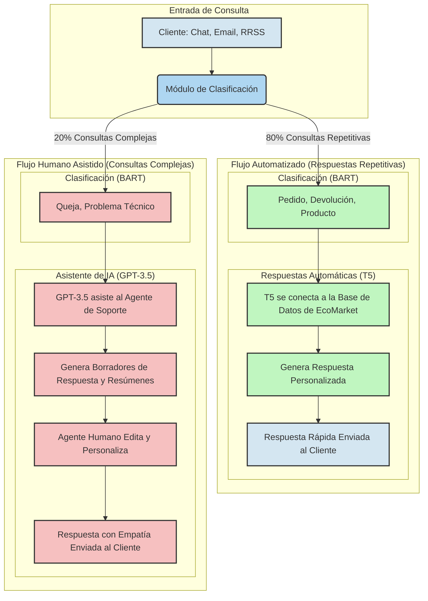

# GenIA-20252-ICESI
This repository will host all projects in the field of generative artificial intelligence.

```mermaid
graph TD
    subgraph "Entrada de Consulta"
        A[Cliente: Chat, Email, RRSS] --> B(Módulo de Clasificación);
    end

    subgraph "Flujo Automatizado (Respuestas Repetitivas)"
        subgraph "Clasificación (BART)"
            B -- "80% Consultas Repetitivas" --> C[Pedido, Devolución, Producto];
        end
        subgraph "Respuestas Automáticas (T5)"
            C --> D[T5 se conecta a la Base de Datos de EcoMarket];
            D --> E[Genera Respuesta Personalizada];
            E --> F[Respuesta Rápida Enviada al Cliente];
        end
    end

    subgraph "Flujo Humano Asistido (Consultas Complejas)"
        subgraph "Clasificación (BART)"
            B -- "20% Consultas Complejas" --> G[Queja, Problema Técnico];
        end
        subgraph "Asistente de IA (GPT-3.5)"
            G --> H[GPT-3.5 asiste al Agente de Soporte];
            H --> I[Genera Borradores de Respuesta y Resúmenes];
            I --> J[Agente Humano Edita y Personaliza];
            J --> K[Respuesta con Empatía Enviada al Cliente];
        end
    end

    style A fill:#D4E6F1,stroke:#333,stroke-width:2px;
    style B fill:#AED6F1,stroke:#333,stroke-width:2px;
    style C fill:#C0F6C0,stroke:#333,stroke-width:2px;
    style D fill:#C0F6C0,stroke:#333,stroke-width:2px;
    style E fill:#C0F6C0,stroke:#333,stroke-width:2px;
    style F fill:#D4E6F1,stroke:#333,stroke-width:2px;
    style G fill:#F6C0C0,stroke:#333,stroke-width:2px;
    style H fill:#F6C0C0,stroke:#333,stroke-width:2px;
    style I fill:#F6C0C0,stroke:#333,stroke-width:2px;
    style J fill:#F6C0C0,stroke:#333,stroke-width:2px;
    style K fill:#F6C0C0,stroke:#333,stroke-width:2px;
```
