```mermaid
graph TD
    subgraph "Entrada de Consulta"
        A[Cliente: Chat, Email, RRSS] --> B(Módulo de Clasificación);
    end

    subgraph "Flujo Automatizado (Respuestas Repetitivas)"
        subgraph "Clasificación (BART)"
            B -- "80% Consultas Repetitivas" --> C[Pedido, Devolución, Producto];
        end
        subgraph "Respuestas Automáticas (T5)"
            C --> D[T5 se conecta a la Base de Datos de EcoMarket];
            D --> E[Genera Respuesta Personalizada];
            E --> F[Respuesta Rápida Enviada al Cliente];
        end
    end

    subgraph "Flujo Humano Asistido (Consultas Complejas)"
        subgraph "Clasificación (BART)"
            B -- "20% Consultas Complejas" --> G[Queja, Problema Técnico];
        end
        subgraph "Asistente de IA (GPT-3.5)"
            G --> H[GPT-3.5 asiste al Agente de Soporte];
            H --> I[Genera Borradores de Respuesta y Resúmenes];
            I --> J[Agente Humano Edita y Personaliza];
            J --> K[Respuesta con Empatía Enviada al Cliente];
        end
    end

    style A fill:#D4E6F1,stroke:#333,stroke-width:2px;
    style B fill:#AED6F1,stroke:#333,stroke-width:2px;
    style C fill:#C0F6C0,stroke:#333,stroke-width:2px;
    style D fill:#C0F6C0,stroke:#333,stroke-width:2px;
    style E fill:#C0F6C0,stroke:#333,stroke-width:2px;
    style F fill:#D4E6F1,stroke:#333,stroke-width:2px;
    style G fill:#F6C0C0,stroke:#333,stroke-width:2px;
    style H fill:#F6C0C0,stroke:#333,stroke-width:2px;
    style I fill:#F6C0C0,stroke:#333,stroke-width:2px;
    style J fill:#F6C0C0,stroke:#333,stroke-width:2px;
    style K fill:#F6C0C0,stroke:#333,stroke-width:2px;
```

# UNIVERSIDAD ICESI
<h1>📚 Maestría en Inteligencia Artificial Aplicada – 3er Semestre</h1>

<h3>Asignatura: Inteligencia Artificial Generativa</h3>

<h4>Taller Práctico Nro. 1 </h4>

<h2>👨‍🎓 Estudiantes</h2>
<ul style="list-style:none; padding:0; font-size:18px;">
    <li>Sebastián Murillas</li>
    <li>Octavio Guerra</li>
</ul>

<h3>📅 Fecha: Septiembre 26, 2025</h3>

---
# Propuesta de Arquitectura Híbrida de Modelos LLM para EcoMarket

Después de varias sesiones donde hemos revisado literatura y documentación de Modelos de LLM y teoría sobre Inteligencia Artificial Generativa, nos hemos decidido por una solución **“Híbrida”** para resolver los altos tiempos de respuesta, 24 horas en promedio, que está impactando a la compañía **EcoMarket** en la métrica de **Satisfacción del Cliente**.

---

## 1. Arquitectura General

Nuestro Modelo Híbrido está compuesto por:

1. **Modelo Fine Tuned LLM**, para atender el **80%** de las consultas repetitivas.  
2. **Modelo LLM** de propósito general, para atender las consultas o preguntas complejas.

### ¿Por qué?

Esta arquitectura permite que el modelo Fine-Tuned se enfoque en **eficiencia**, mientras que el LLM aporta **capacidad de comprensión** en consultas complejas.  
Esto resolverá el problema más importante de EcoMarket: **reducir los tiempos de respuesta de 24 horas a minutos**.  

En cuanto a costos, usar un esquema Híbrido permite:  
- Operar con un **presupuesto moderado** para resolver la parte repetitiva.  
- **Estimar un costo límite máximo** al usar un LLM en los casos complejos.  

La elección del modelo se basa en un análisis de **costo-beneficio** centrado en la tarea específica que debe resolver cada componente.

---

### 1.1. Para el 80% de Consultas (Repetitivas: Pedidos, Devoluciones, Catálogo)

**Modelo Elegido (Ejemplo):** LLM Ligero y Open Source (e.g., *Mistral 7B*) + Afinamiento (Fine-Tuning)

| Criterio               | Justificación |
|-------------------------|---------------|
| **Necesidad de Precisión** | Alta. Una respuesta incorrecta sobre el estado de un pedido (ej: "entregado" cuando está "en camino") es crítica para la satisfacción. |
| **Ventaja del Afinamiento** | Al aplicar Fine-Tuning sobre un modelo ligero base (como Mistral 7B), el modelo aprende el vocabulario, la estructura de las preguntas frecuentes y el tono de EcoMarket. Esto permite rapidez y precisión en su dominio. |
| **Costo Operacional** | Bajo. Los modelos ligeros son más baratos de alojar en infraestructura propia o en la nube. Solo se activan cuando se requieren, manejando eficientemente el grueso del tráfico. |

---

### 1.2. Para el 20% de Consultas (Complejas: Quejas, Problemas, Sugerencias)

**Modelo Elegido (Ejemplo):** LLM de Propósito General de Alto Rendimiento (e.g., *GPT-4o, Gemini 1.5 Pro*)

| Criterio               | Justificación |
|-------------------------|---------------|
| **Necesidad de Fluidez/Razonamiento** | Alta. Estas consultas exigen comprender el contexto emocional (empatía), sintetizar información de múltiples fuentes y seguir instrucciones complejas. |
| **Ventaja de Rendimiento** | Modelos como GPT-4o y Gemini 1.5 Pro poseen razonamiento en cadena (*chain-of-thought*) y uso de herramientas (*Function Calling*). Esto permite clasificar y derivar quejas a los agentes correctos, con un resumen pre-analizado. |
| **Costo Operacional** | Moderado/Alto. El costo por token es mayor, pero al representar solo el 20% del volumen de tráfico, la inversión se justifica porque impacta directamente en la **Satisfacción del Cliente (CSAT)**. |

---

## 2. Arquitectura Propuesta

Nuestra arquitectura es un **sistema de Orquestación** con **decisión basada en el tráfico**, combinando modelos Fine-Tuned con modelos de Propósito General.

### 2.1. Arquitectura Lógica

1. **Orquestador/Router:**  
   - Recibe cada consulta del cliente.  
   - Usa un modelo ligero (ej: *GPT-4o Mini*) afinado para clasificación.  
   - Decide: ¿Es repetitiva (80%) o compleja (20%)?  

2. **Ruta del 80% (Eficiencia):**  
   - La consulta pasa al **Modelo Fine-Tuned**.  
   - Este modelo integra una capa de **RAG (Retrieve Augmented Generation)** para consultar la base de datos de EcoMarket.  

3. **Ruta del 20% (Capacidad):**  
   - La consulta pasa al **Modelo Potente**.  
   - Este modelo usa **Function Calling** para iniciar procesos especializados (ej: registrar una queja en el CRM o generar un ticket de soporte).  

---

### 2.2. Integración con la Base de Datos (BD) de EcoMarket

| Mecanismo de Integración | Propósito | Aplicación en EcoMarket |
|--------------------------|-----------|--------------------------|
| **RAG (Retrieve Augmented Generation)** | Consultar datos en tiempo real (solo lectura). | Estado del pedido, información de envío, inventario y catálogo. |
| **Function Calling / Herramientas** | Ejecutar acciones o registrar datos (lectura y escritura). | Registrar devoluciones, actualizar quejas o ejecutar scripts de diagnóstico. |

---

### 2.3. Propósito del Modelo

El sistema propuesto combina:  
- **Modelo de propósito general** (el Router y el 20%),  
- **Datos específicos de la empresa** (80% mediante Fine-Tuning y RAG).  

---

## 3. Justificación Basada en Criterios de Ingeniería

| Criterio               | Justificación |
|-------------------------|---------------|
| **Costo** | Optimización del TCO. El 80% del tráfico va a un LLM Fine-Tuned económico (ej. Mistral 7B). Solo se paga un modelo premium para el 20% de casos críticos. |
| **Escalabilidad** | Escalabilidad paralela: el 80% se maneja con clusters de modelos ligeros en GPUs económicas. El 20% escala en la nube de proveedores de LLM de alto nivel (OpenAI/Google). |
| **Facilidad de Integración** | Uso de estándares como RAG y Function Calling, lo que simplifica el desarrollo y reduce la curva de aprendizaje del equipo de ingeniería. |
| **Calidad de Respuesta** | Precisión garantizada en el 80% repetitivo (Fine-Tuning + RAG) y razonamiento superior en el 20% complejo (modelos avanzados). |

---

