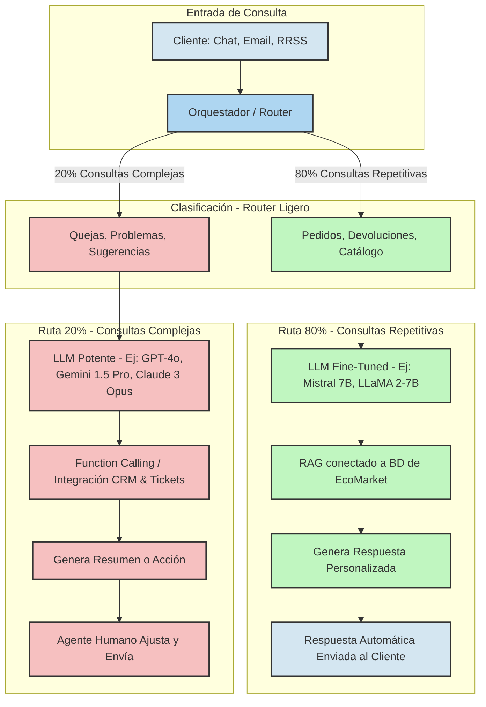

<h1> </h1>
<h1>📚 Maestría en Inteligencia Artificial Aplicada – 3er Semestre</h1>

<h3>Asignatura: Inteligencia Artificial Generativa</h3>

<h3>Taller Práctico Nro. 1 </h3>

<h3>👨‍🎓 Estudiantes</h3>
<ul style="list-style:none; padding:0; font-size:18px;">
    <li>Sebastián Murillas</li>
    <li>Octavio Guerra</li>
</ul>

<h3>📅 Fecha: Septiembre 28, 2025</h3>

---
# Fase I - Propuesta de Arquitectura IAG para Optimización del servicio al Cliente de la compañia EcoMarket

Tras revisar la literatura y la documentación sobre Modelos de Lenguaje Grande (LLM) y la teoría de la Inteligencia Artificial Generativa, nosotros proponemos una solución **Híbrida**. Este enfoque busca mitigar el impacto negativo de los altos tiempos de respuesta (24 horas en promedio) en la métrica de **Satisfacción al Cliente** de la compañia **EcoMarket**, en conjunto con un manejo costo-eficiencia, que es también importante para la compañia.

---

## 1. Arquitectura General

Nuestro Modelo Híbrido está compuesto por:

1. **Modelo Fine Tuned LLM**, para atender el **80%** de las consultas repetitivas. Ejemplos posibles de uso: GPT-4omini, Gemini 1.5 Flash, Mistral 7B Instruct 
2. **Modelo LLM** de propósito general, para atender las consultas o preguntas complejas (**20%**). Ejemplos posibles de uso: GPT-4, Claude 3.5 Sonnet.

### ¿Por qué?

Esta arquitectura permite que el modelo Fine-Tuned se enfoque en **eficiencia** y resuelva en menor tiempo las consultas repetitivas que se reciben; mientras que, un modelo LLM (Open source o pagado) contribuye a brindar una  **capacidad de comprensión** en consultas complejas de los clientes o derivando a un Agente de Call Center, si asi se requiere.  
Esto resolverá el problema más importante de EcoMarket: **Los tiempos de respuesta que hoy son de 24 horas** y reducirlos a   a **Minutos** con el uso de los agentes de respuesta usando LLM (Large Language Models), que han sido entrenados para esto.  
En cuanto a costos, usar un esquema Híbrido permite:  
- Operar con un **presupuesto moderado** para resolver la parte repetitiva.  
- **Estimar un costo límite máximo** al usar un LLM en los casos complejos.  

La elección del modelo se basa en un análisis de **costo-beneficio** centrado en la tarea específica que debe resolver cada uno de los componentes de la solución Híbrida que proponemos.

---

### 1.1. Para el 80% de Consultas (Repetitivas: Pedidos, Devoluciones, Catálogo)

**Modelo Elegido (Ejemplo):** LLM Ligero y Open Source (e.g., *Mistral 7B*) + Afinamiento (Fine-Tuning)

| Criterio               | Justificación |
|-------------------------|---------------|
| **Necesidad de Precisión** | Alta. Una respuesta incorrecta sobre el estado de un pedido (ej: "entregado" cuando está "en camino") es crítica para la satisfacción al Cliente. |
| **Ventaja del Afinamiento** | Al aplicar Fine-Tuning sobre un modelo ligero base (como Mistral 7B), el modelo aprende el vocabulario, la estructura de las preguntas frecuentes y el tono de EcoMarket. Esto permite rapidez y precisión en su dominio. |
| **Costo Operacional** | Bajo. Los modelos ligeros son más baratos de alojar en infraestructura propia o en la nube. Solo se activan cuando se requieren, manejando eficientemente el alto tamaño de preguntas que recibirá. |

---

### 1.2. Para el 20% de Consultas (Complejas: Quejas, Problemas, Sugerencias)

**Modelo Elegido (Ejemplo):** LLM de Propósito General de Alto Rendimiento (e.g., *GPT-4o, Gemini 1.5 Pro*)

| Criterio               | Justificación |
|-------------------------|---------------|
| **Necesidad de Fluidez/Razonamiento** | Alta. Estas consultas exigen comprender el contexto emocional (empatía), sintetizar información de múltiples fuentes y seguir instrucciones complejas. |
| **Ventaja de Rendimiento** | Modelos como GPT-4o y Gemini 1.5 Pro poseen razonamiento en cadena (*chain-of-thought*) y uso de herramientas (*Function Calling*). Esto es esencial para clasificar correctamente la queja y determinar a qué agente o departamento derivarla, proporcionando al humano un resumen pre-analizado. |
| **Costo Operacional** | Moderado/Alto. El costo por token es mayor, pero al representar solo el 20% del volumen de tráfico, la inversión se justifica porque impacta directamente en la **Satisfacción al Cliente**. |

---

## 2. Arquitectura Propuesta

Nuestra arquitectura es un **sistema de Orquestación** con **decisión basada en el tráfico**, combinando LLM con "Fine-Tuned" y LLM de Propósito General.

### 2.1. Arquitectura Lógica

1. **Orquestador/Enrutador:**  
   - Recibe cada consulta del cliente.  
   - Usa un modelo ligero (ej: *GPT-4o Mini*) afinado para clasificación.  
   - Decide: ¿Es repetitiva (80%) o compleja (20%)?  

2. **Ruta del 80% (Eficiencia):**  
   - La consulta pasa al **Modelo Fine-Tuned LLM**.
   - Este modelo integra una capa de **Generación Aumentada por Recuperación (RAG)** para interactuar con la Base de Datos de EcoMarket (solo lectura de datos estáticos y fácticos, ej. estados de envío, descripción de productos, devoluciones).

3. **Ruta del 20% (Capacidad):**
   - Si es compleja, la consulta pasa al **Modelo LLM**.
   - Este modelo usa la funcionalidad de Llamada a Funciones **(Function Calling)** para iniciar procesos especializados (ej: registrar una queja en el CRM o generar un ticket de soporte).
   - Si el modelo determina que la pregunta supera su capacidad de resolución (ej. requiere una negociación con el cliente), lo envía a un Agente de Call Center, acompañado de un **resumen** y un **sentiment score**.
   
---

### 2.2. Integración con la Base de Datos (BD) de EcoMarket

| Mecanismo de Integración | Propósito | Aplicación en EcoMarket |
|--------------------------|-----------|--------------------------|
| **RAG (Retrieve Augmented Generation)** | Consultar datos en tiempo real (solo lectura). | Estado del pedido, información de envío, inventario y catálogo. |
| **Function Calling / Herramientas** | Ejecutar acciones o registrar datos (lectura y escritura). | Registrar una devolución, actualizar el status de una queja, o ejecutar un script de diagnóstico para un problema técnico, ej.: Pedido no registrado, falla en acceso al portal de Ecomarket, etc. |

---

## 3. Justificación

| Criterio               | Justificación |
|-------------------------|---------------|
| **Costo** | Optimización del TCO. El 80% del tráfico va a un LLM Fine-Tuned económico (ej. Mistral 7B). Solo se paga un modelo premium para el 20% de casos críticos. |
| **Escalabilidad** | La parte repetitiva que corresponde al 80%, se  puede manejar con un esquema de cluster uando equipos con GPUs económicas en DataCenter o por demanda en Nube Pública. La parte compleja, que corresponde al 20% , se trabaja en la nube de proveedores de LLM de alto nivel: OpenAI/Google. Donde se puede establecer un uso máximo pagado para brindar las respuestas a las solicitudes de este tipo. |
| **Facilidad de Integración** | Uso de estándares como RAG y Function Calling, lo que simplifica el desarrollo y reduce la curva de aprendizaje del equipo de ingeniería del cliente. |
| **Calidad de Respuesta** | Precisión garantizada en el 80% repetitivo (Fine-Tuning + RAG) y razonamiento superior en el 20% complejo con el uso  de modelos avanzados. |

---

# Fase II - Evaluación de Fortalezas, Limitaciones y Riesgos Éticos

### 4. Fortalezas
- **Reducción en los Tiempos de Respuesta de Servicio al Cliente:**  
  Es definitivamente el principal beneficio. El 80% de las consultas se resuelven en minutos, no en horas, impactando de manera positiva la métrica de **Satisfacción del Cliente**, que es al final lo solicitado por la compañia.
  
- **Disponibilidad 24/7:**  
  Por ser un modelo "Fine Tuned LLM", estará disponible de manera continua, 7x24, para manejar el alto volumen de consultas repetitivas. Esto de nuevo, redunda de manera positiva en la **Satisfacción al Cliente**.

- **Coherencia y Consistencia:**  
  Se asegura una única fuente de información para el alto volumen repetitivo de preguntas, eliminando las variaciones y errores que surgen de las respuestas humanas. En otras palabras habrá una tendencia a la reducción en respuestas erróneas, inconsistentes o la demora en las respuestas a todas estas solicitudes que se reciban.

- **Especialización de la Labor del Agente Humano:**  
  Los agentes se liberan del trabajo repetitivo, pudiendo enfocarse solo en el 20% que corresponde a los casos complejos, donde su empatía y pensamiento crítico son realmente valiosos.

---

### 5. Limitaciones
- **Limitación en la Empatía:**  
  Si bien se ofrece un "fine tuned LLM" al igual que un Modelo LLM para responder a lo repetitivo y lo complejo. En los casos donde se requiere negociación o manejo de crisis, estos modelos no pueden replicar la inteligencia emocional de un agente humano. Es por eso, que el Agente de Call Center debe atender al cliente en estas situaciones y no puede estar fuera del proceso.

- **Dependencia en la Calidad de los Datos:**  
  Si queremos contar con una precisión mayor o igual al 80%, dependeremos completamente de la exactitud y limpieza de la **Base de Datos de EcoMarket**.  
  Si hay errores, información incompleta, muy pocos datos o inexistentes, el **LLM Fine-Tuned** generará respuestas erroneas o equivocadas o empezará a alucinar. Esto afectara la **Satisfacción al Cliente** y pondrá en riesgo la reputación de la compañia. Es lo que siempre se maneja como lema en la Inteligencia Artificial: **Basura Entra (Garbage In)** -->  **Basura Sale (Garbage Out)**

- **Costos de Entrenamiento (Fine-Tuning):**  
 La inversión inicial en tiempo y recursos para afinar el modelo y alcanzar una precisión igual o superior al 80% puede ser considerable. Sin embargo, estimamos que este esfuerzo resultará más económico que depender de un LLM con costos recurrentes de tokens y llamadas a API. Por ello, será fundamental una planificación adecuada que mantenga los costos bajo control y garantice la viabilidad del proyecto.

---

### 6. Riesgos Éticos y de Gobernanza de Datos
- **Alucinaciones:**  
  Siempre existe el riesgo de que LM  invente información (una *"alucinación"*) al generar datos de pedidos, productos, un resumen o un diagnóstico complejo.  
  *Mitigación:* Implementar filtros de verificación de hechos en la fase de **Function Calling** antes de generar la respuesta al cliente y mecanismo de validación de respuestas a las preguntas repetitivas.

- **Sesgo:**  
  Si los datos utilizados para el Fine-Tuning contienen sesgos históricos (ej. si las quejas de un grupo demográfico específico fueron mal manejadas históricamente), el modelo podría perpetuar y automatizar ese trato preferencial o injusto.  
  *Mitigación:* Auditoría de sesgos en el dataset de entrenamiento y en las respuestas generadas.

- **Privacidad de Datos:**  
  Al integrar la BD de clientes (direcciones, historial de compras, entre otros) en el contexto de los prompts (ya sea **RAG** o **Function Calling**), se debe asegurar que:  
  1. Los datos están anonimizados o se accede solo a la información mínima necesaria.  
  2. Se implementa un estricto control de acceso y almacenamiento temporal del contexto (*borrado inmediato después de la respuesta*).
  3. Autenticación de usuarios para identificar quién accede y tener una auditoría de todo el flujo de interacción.
  4. Usar un "Servicio Intermedio" para evitar que alguno de los modelos LLM usados interactué directamente con la o las bases de datos de **EcoMarket**

- **Impacto Laboral:**
  Los cambios Tecnologicos o de algun otro tipo en las compañias siempre generan incertidumbre en la fuerza laboral activa. Tenemos claro que habrá reducción del personal actual de Agentes usado para el servicio al cliente. Debemos manter como objetivo principal: que se trata de **mejorar, empoderar y no reemplazar**. La propuesta debe ser vista por EcoMarket como una herramienta que eleva el trabajo de los agentes de soporte, permitiéndoles enfocarse en la calidad y la retención del cliente, en lugar de en la cantidad de tickets repetitivos que son lo que a hoy esta desbordado, haciendolo ineficiente y con alta tasa de insatisfacción; lo que es crítico para una compañia emergente como EcoMarket.

  # Fase III - Aplicación de Ingeniería de Prompts

  A continuación presentamos los **PROMPTS** que hemos diseñado para los dos (2) requerimientos que se solicitan.

  ### 1. Estado de Solicitud de Pedido

  prompt_pedido =
  f"""
  Eres un agente de servicio al cliente amable, profesional y conciso.
  Tu única tarea es proporcionar el estado del pedido {num_pedido} con un **lenguaje natural y conversacional**, basándote estrictamente en la siguiente información:

  - **Número de Pedido:** {num_pedido}
  - **Estado Actual:** {estado}
  - **Fecha de Entrega Estimada:** {estimacion_formateada}
  - **Retrasado:** {retrasado}
   {instruccion_tracking_data}

   **INSTRUCCIONES DE FORMATO DE RESPUESTA:**
   1.  Comienza con una frase que indique el estado y la estimación de entrega (si aplica), usando el formato: "Su orden {num_pedido} se encuentra {frase_estado}. La fecha de entrega estimada es {estimacion_formateada}."
   2.  Si la estimación es 'No aplica' (como en el caso de 'Cancelado' o 'Entregado'), omite la parte de la fecha de entrega, solo indica el estado.
{instruccion_tracking} 4. Si **Retrasado** es True, añade el siguiente mensaje al final: "Nos excusamos por la demora en la entrega y estamos trabajando para que pueda contar con su orden lo mas pronto posible."
   5.  Si el **Estado Actual** es 'Cancelado', añade el siguiente mensaje al final: "Lamentamos los inconvenientes y le invitamos a comunicarse con nuestro centro de servicios al Nro. 01-800-XXX-XXXX para tener más detalles."
   6.  **IMPORTANTE:** Tu respuesta NO debe contener encabezados, listas numeradas, ni repetir la información de entrada, solo debe generar el texto conversacional.

  Respuesta:
  """

  ### 2. Devolución de Producto

     prompt = 
     f"""
     Actúa como un agente de servicio al cliente amable y profesional.
      Usa la siguiente base de datos de productos:

     {base_datos_devoluciones}

     Instrucciones para el Asistente:
     1. Responde inmediatamente al cliente siguiendo las instrucciones de formato.
     2. Identifica el producto por su ID (ej. Producto 2002) y su nombre.
     3. Revisa si el producto es retornable.
     4. Si es retornable, indica **Retornable** y explica el proceso.
     5. Si NO es retornable, indica **No retornable**, explica la razón y ofrece alternativas/descuentos.
     6. Da la respuesta en el siguiente formato:
      - **Estado del producto**: (Retornable / No retornable)
      - **Explicación**
      - **Siguientes pasos / Alternativas**
    7. Mantén la respuesta clara y concisa, máximo 5 párrafos.
    8. Usa un tono cálido, humano y profesional.

    ---
    Cliente: Hola, estoy devolviendo {producto_buscado} por {motivo}, ¿qué debo hacer?

    {MARCADOR_ASISTENTE}"""

### 3. Prueba de los PROMPTS

En este Repositorio de GitHub hay un Google Colab Notebook que se llama **IAG_Taller1_Fase_3.ipynb**, donde hicimos las pruebas con los dos (2) Prompts diseñados. 

El LLM (Large Language Model) que usamos fue: mistralai/Mistral-7B-Instruct-v0.2. 

**¿Por qué este LLM ?**
De los modelos que consultamos y revisamos, seleccionamos este en especial por las siguientes razones:
- Fue ajustado (fine-tuned) con ejemplos de instrucciones y respuestas humanas, que es lo que tiene mayor relevancia al usarlo en la creación de PROMPTS.
- Está optimizado para seguir PROMPTS *tipo instrucciones*, como los que estamos usando en el diseño:
    - “Actúa como un agente de servicio al cliente…”
    - “Responde en formato claro y conciso…”
    - “Devuélveme solo este campo…”
- Y por último, pudimos notar que produce respuestas más estructuradas, coherentes y útiles en comparación con un modelo de transformers con BERT e inclusive algunos modelos de Generación de Texto.

### 4. Ejecución del Google Colab Notebook.
Para ejcutarlo solo se requiere dar **"Clic"** con el ratón en el icono **"Open Google Colab"** que aparece en el archivo **IAG_Taller1_Fase_3.ipynb**
